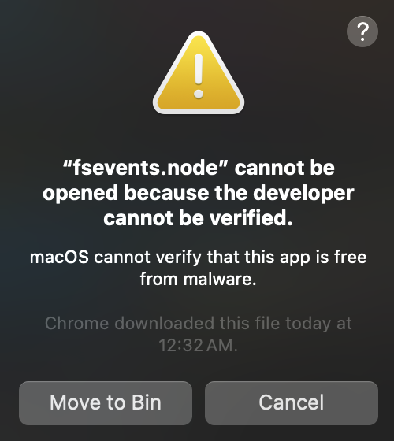

# 📝 Vintage To-do List
✨ This is a to-do list with a vintage theme. It can be used on latops or phones but it is highly recommended to be used on laptops/desktops for a better user interface. 
 
The to-do list is deployed which can be found in this link: https://vintage-todo-list.com/ 

## 🗣️ Language & Frameworks
* React.JS
* HTML
* JS
* CSS

## 🔧 Set Up React Website
1. Open the the file in a code editor (ie. VS Code)
2. Open the terminal and type: cd pathway_to_todo-app
3. Press Enter
4. Then type: npm start
5. Press Enter
6. This will bring you to the website directly  
💭 Please read the bug section below and feel free to reach out if you encounter any other errors!

## ⛑️ Instructions for Using the To-do List
#### 📎 Add Task
1. Input the task title, description and due date
2. Press add button 
3. Preview it in the Todo tab
#### 📎 Change Task / Status
* Press the tick icon to change status to completed
* Press the pencil icon to edit task
* Press the bin icon to delete task (this action cannot be recovered)
* Press the restore icon in the completed tab to restore the task back to the todo tab

## ⚜️ Key Features & Designs
* The tasks are store in your local storage, which means that they will not be deleted even you refresh or delete the tab
  (unless you change to a different device or browser (ie. Chrome, Edge, FireFox)
* The highlighting color matches with the theme instead of using the default blue color
* The font family was intentionally set to a typewriter style to give a vintage vibe

##### I hope you find this to-do list useful and pretty!

## 👾 Bugs

If you encounter this error, please press "Move to Bin"

